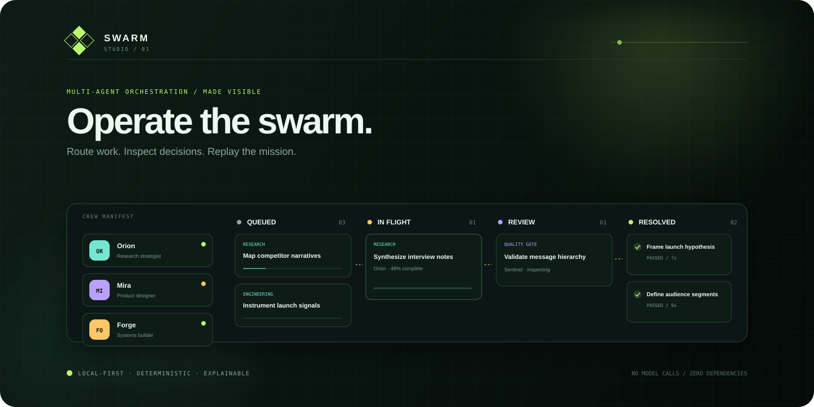
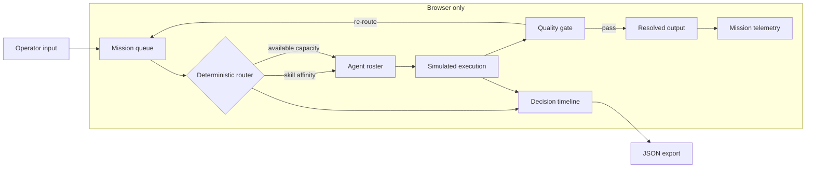

<p align="center">
  
</p>

<p align="center">
  
  
  
  
</p>

<h1 align="center">Swarm Studio</h1>

<p align="center">
  A tactile mission-control interface for understanding how specialist AI-agent teams<br />
  receive, route, execute, review, and resolve work.
</p>

> [!IMPORTANT]
> Swarm Studio is an explainable, deterministic **simulation**. It makes no model, agent, or network calls. Token counts, latency, and agent activity are synthetic demo telemetry.

[Open the live studio ↗](https://harshareddy0405.github.io/swarm-studio/) · [Engineering notes](docs/ENGINEERING.md) · [Quality checks](https://github.com/harshareddy0405/swarm-studio/actions)

## Why this exists

Multi-agent diagrams look tidy; real orchestration does not. Capacity changes, specialist skills overlap, tasks stall at quality gates, and the routing logic is often invisible. Swarm Studio turns those abstractions into a board you can operate and inspect.

It is designed as a product-thinking prototype: polished enough to communicate a system, small enough to read in one sitting, and honest about where simulation ends and production infrastructure begins.

## Highlights

- **Deterministic live run** — play, pause, or advance the swarm one tick at a time.
- **Explainable routing** — tasks are scored by work-type affinity and current agent load.
- **Four specialist agents** — research, design, engineering, and quality roles with overlapping skills.
- **Interactive orchestration board** — create tasks, inspect details, and drag work between stages.
- **Visible quality gates** — work progresses from queue → flight → review → resolved.
- **Black-box timeline** — filter route and work events, then export the full session as JSON.
- **Persistent workspace** — tasks, preferences, logs, and simulation progress survive refreshes.
- **Operator ergonomics** — keyboard shortcuts, focus states, reduced-motion support, responsive layouts, and light/dark themes.

## Architecture



The application uses a tiny state container in `app.js`. Every UI view is derived from that state; mutations pass through explicit actions such as `simulationStep`, `moveTask`, and `createTask`. State is persisted to `localStorage`, while exports use an in-memory `Blob`.

## Quick start

No installation or build step is required.

```bash
git clone https://github.com/harshareddy0405/swarm-studio.git
cd 05-swarm-studio
python3 -m http.server 8080
```

Open [http://localhost:8080](http://localhost:8080). You can also open `index.html` directly in a modern browser.

## Use the studio

1. Select **Run swarm** to start deterministic ticks, or use **⇥** to step once.
2. Watch the router move high-priority work to the best-fit available agent.
3. Select an agent to focus their assigned work.
4. Drag task cards between stages to override the simulated route.
5. Create a task with **N** and give it a work type and priority.
6. Inspect a card for its owner, state, priority, and progress.
7. Export the decision log for a portable snapshot of the session.

### Keyboard shortcuts

| Key               | Action                      |
| ----------------- | --------------------------- |
| `Space`           | Run or pause the swarm      |
| `N`               | Open the new-task dialog    |
| `R`               | Restore the seeded demo     |
| `Enter` / `Space` | Inspect a focused task card |

Shortcuts are disabled while typing or while a dialog is open.

## Project structure

```text
05-swarm-studio/
├── assets/
│   └── cover.svg       # Repository hero artwork
├── index.html          # Semantic interface and dialog structure
├── styles.css          # Responsive mission-control visual system
├── app.js              # State, routing, simulation, persistence, export
├── README.md
├── LICENSE
└── .gitignore
```

## Simulation model

The router ranks every agent with a deliberately legible score:

```text
route score = (work-type affinity × 10) − (active assignments × 3)
```

Priority determines queue order. Each tick advances in-flight tasks by a seeded amount; completed work enters a three-tick review gate before resolution. This is not a benchmark and is not intended to predict LLM cost or speed.

## Privacy & local-first design

All application logic and demo data remain in the browser. Swarm Studio does not load third-party scripts, use analytics, send telemetry, or require credentials. The only persistent data is the workspace snapshot stored under `swarm-studio-v1` in your browser's local storage. **Reset demo** replaces that snapshot with the seeded mission.

## Roadmap

- [ ] Editable agent skill matrices and capacity policies
- [ ] Visual route-policy builder with weighted constraints
- [ ] Importable mission fixtures and replayable run files
- [ ] Failure, retry, escalation, and human-approval states
- [ ] Optional adapter interface for user-supplied orchestration backends
- [ ] Timeline scrubbing and side-by-side strategy comparison

## Contributing

Small, focused pull requests are welcome. Please keep the zero-dependency constraint, preserve keyboard operation, and label any simulated metric or behavior clearly. For interaction changes, include a short before/after description and test at desktop and mobile widths.

## License

Released under the [MIT License](LICENSE).

## Built to be inspected

[](https://github.com/harshareddy0405/swarm-studio/actions/workflows/ci.yml)

The project includes versioned source, guarded local persistence, malformed-data recovery, product-specific interaction tests, and automated accessibility semantics checks. No API key is required to explore it.

```bash
# Optional development checks; the app itself needs no installation
npm ci --ignore-scripts
npm run check
npm test
npm run format:check
```

[Engineering notes](docs/ENGINEERING.md) · [Contributing](CONTRIBUTING.md) · [Security & privacy](SECURITY.md)

**Scope:** Agents do not call an LLM. Work progress, routing examples, and completion traces belong to a local scheduling simulation.
